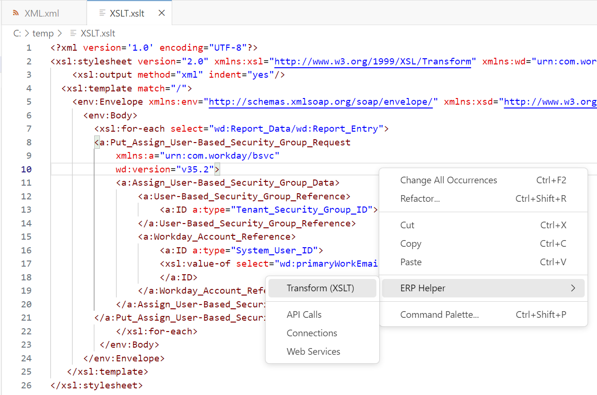

# ERP Helper for VS Code

**ERP Helper (VS Code)** is a [Visual Studio Code]([https://code.visualstudio.com/) extension with a set of utilities for developing ERP integrations. It includes XSL transformation and Workday® API SOAP calls.

## How to install

Install ERP Helper from the [Visual Studio Code Marketplace](https://marketplace.visualstudio.com/items?itemName=WhitleyMedia.erp-helper).

## Features

* XSLT Transformation with Saxon-HE
* Web Service sample SOAP request generator
* Workday API Connector

### How to use

From any open editor, right-click (Windows) or control-click (Mac) and locate ERP Helper on the context menu.

### XML Transformations (XSLT)
To perform the most common function (XML transformation with XSLT) follow these instructions:
1. Open the XML document in an editor window.
2. Open the XSLT document in an editor window to the right of the XML document (as shown in the image below). 
   To ensure that your final output is formatted correctly, include an output element with the indent attribute: <code><xsl:output method="xml" indent="yes" /></code>
3. Right-click or control-click to reveal the context menu.  select <i>ERP Helper</i> > <i>Transform (XSLT)</i>.
4. The transformed document will open in a new window.

##   

## Extension Settings

This extension contributes the following settings:

* `erp-helper.webServiceSelected`: Most recent Web Service selection under Web Services.
* `erp-helper.webOperationSelected`: Most recent Web Operation selection under Web Services.
* `erp-helper.connectionSelected`: Most recent Connection selection under Connections.
* `erp-helper.connectionList`: Workday tenant connection information.  Passwords are saved in secret storage.

## Credits

ERP Helper is compatible with Workday®
It is not sponsored, affiliated with, or endorsed by Workday.

- Stormloop Technologies
  - Thank you to Stormloop Technologies for sponsoring the development of ERP Helper. Please check out their service offerings.
  - https://www.stormlooptech.com/

- Saxon - HE
  - https://licenses.nuget.org/MPL-2.0
  - https://www.saxonica.com/

- Axios
  - https://github.com/axios/axios/blob/v1.x/LICENSE
  - https://github.com/axios/axios

- Cheerio
  - https://github.com/cheeriojs/cheerio/blob/main/LICENSE
  - https://github.com/cheeriojs/cheerio
